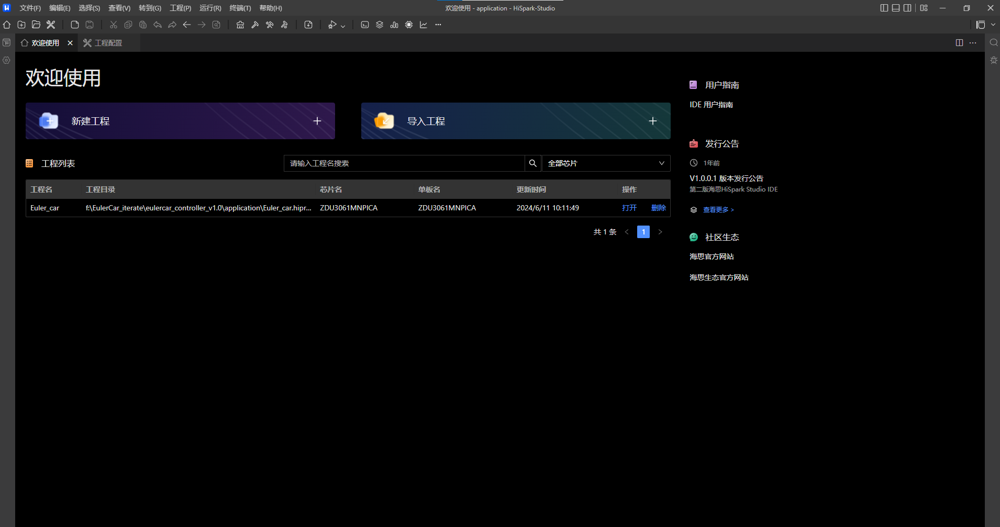
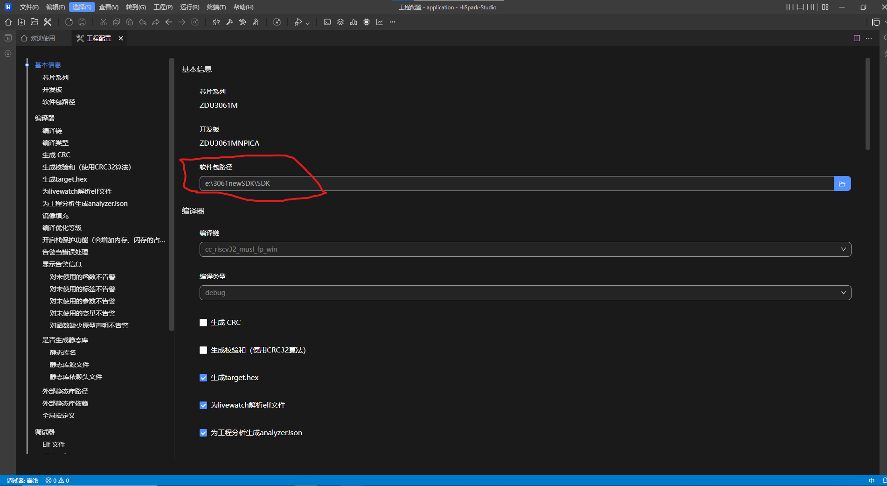
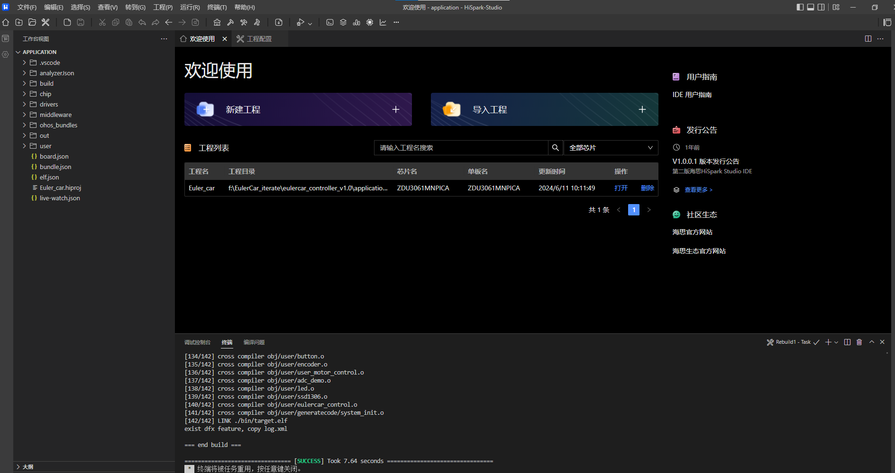
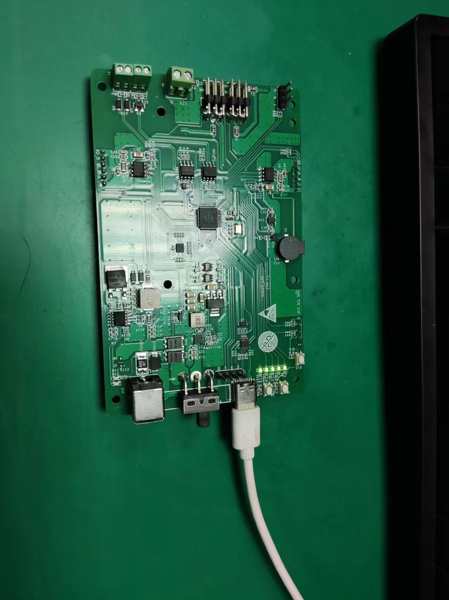
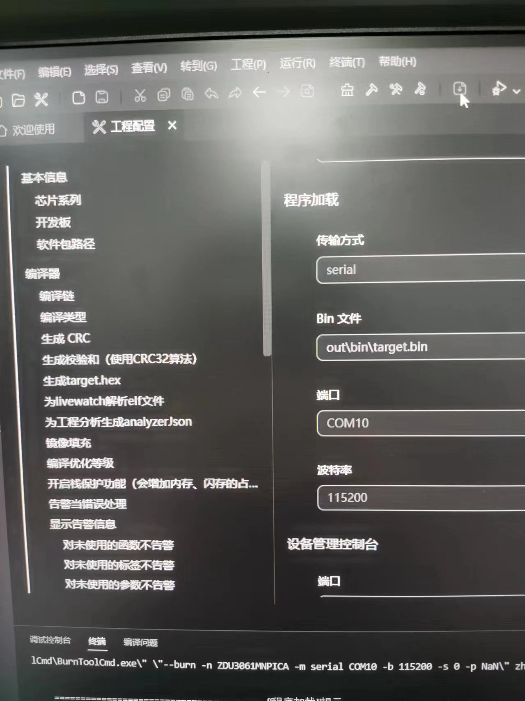
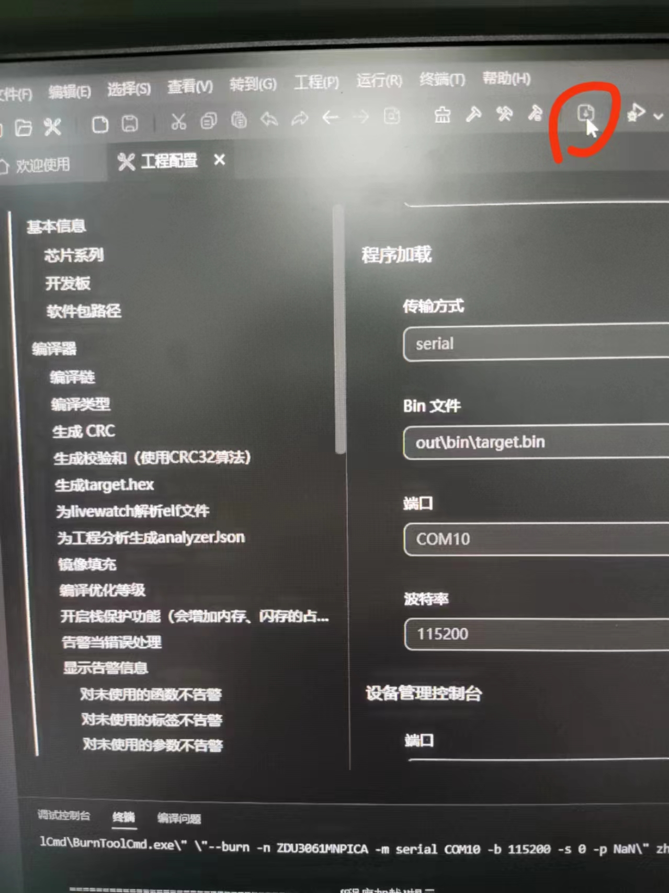
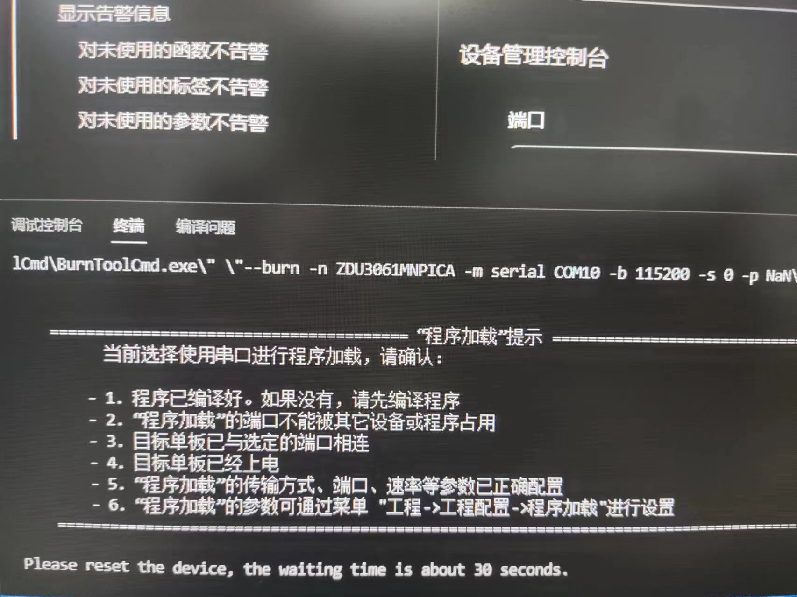
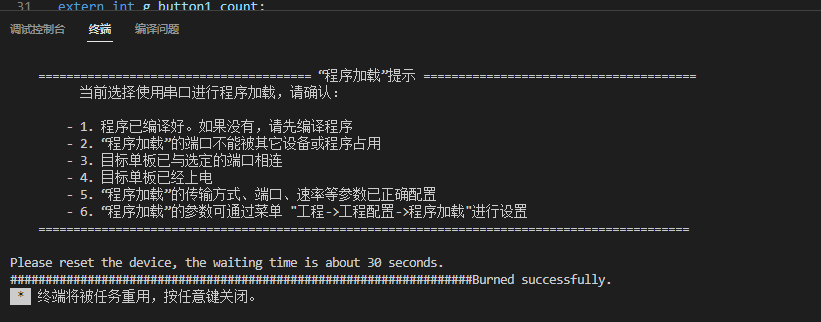
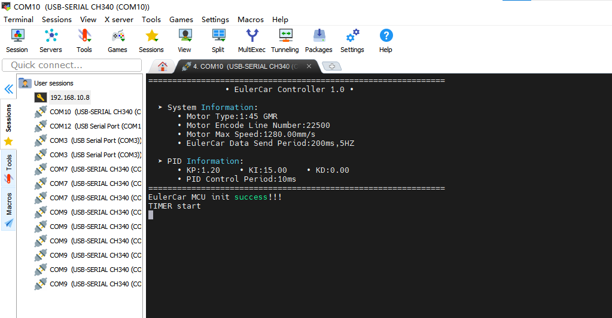

# eulercar_controller

#### 介绍
该仓用于存放eulercar mcu底盘代码和MCU开发IDE、MCU开发板指导手册

#### 软件架构
软件架构说明

#### 安装教程

1.  Hispark Studio IDE 版本下载链接（推荐使用）： https://hispark-obs.obs.cn-east-3.myhuaweicloud.com/HiSparkStudio.exe

2.  海思MCU3061M的SDK下载链接：https://gitee.com/Solarec/open_solarec

3.  Hispark Studio IDE和海思MCU3061M开发板使用手册下载链接：https://gitee.com/Solarec/tools

#### 使用说明

1.  安装Hispark Studio，安装教程链接：https://gitee.com/Solarec/tools/blob/master/HiSparkStudio%20%E4%BD%BF%E7%94%A8%E6%8C%87%E5%8D%97%20V00B05.pdf

2.  修改工程配置，将SDK路径换为自己下载的SDK路径

3. 编译自己的嵌入式MCU源码

1）开发板硬件连接

2）修改工程配置传输方式串口和端口号、波特率115200

3）按一下开发板此处和按一下板端reset

4）烧录成功

5）MobaX显示

